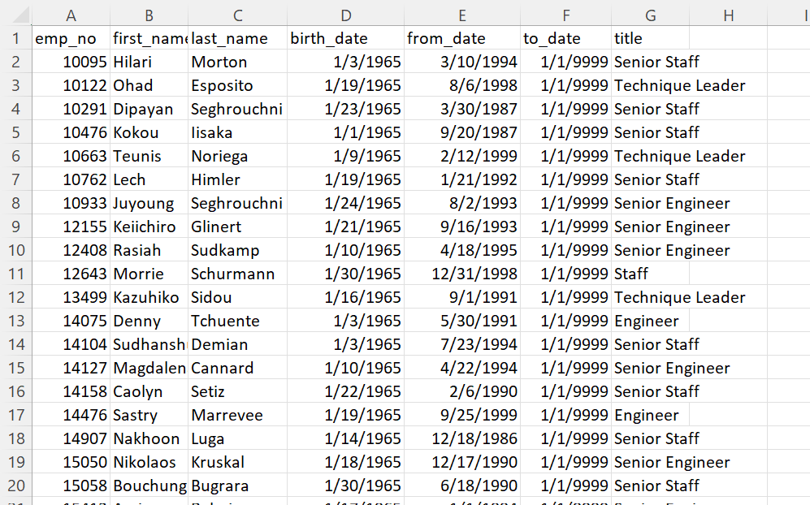

# Pewlett Hackard Analysis

## Overview of the analysis

The purpose of this analysis is to aid Pewlett Hackard, a very large company, help manage the sizeable group of employees who are approaching retirement age. The task is to identify employees who are most likely to retire soon by their title and also employees who could transition to a mentorship program before complete retirement. 

#### Employee Data:
Pewlett Hackard stores their employee data in 6 different csv files. Below is the entity relationship diagram (ERD):

## Results

#### Deliverable 1: Employee totals approaching retirement

* There are a total 72,458 employees approaching retirement age.
* Over 50,000 of them are senior staff and engineers. This represents a huge amount of knowledge and talent potentially leaving Pewlett Hackard in a short time span.

#### Deliverable 2: Mentor eligibility list 

* 1,549 employees were born in 1965
* In order to incentivize eligible employees to mentor newer employees, flexibility of schedule and remote work options should be considered.

## Summary
* There are 72,458 employees that are approaching retirement. See Deliverable 1 in the Results section. The current criteria yields only 1,549 mentors to pass along their knowledge to new hires. This is one mentee to over 46 new employees. The titles of the current mentor eligibility have been counted via query:

Clearly, more mentors are needed in order to provide ideal support. 
* Another query was performed to provide additional possible mentors. The list of retiring employees was filtered to list the employees who were around 35 years old when starting job with current job title. The yields 1,034 additional mentors: 438 Senior Engineers, 397 Senior Staff and 199 Technique Leaders. This brings the mentor to mentee ratio down to around 28. In order for the mentorship program to be successful, Pewlett Hackard will have to think of new ways to incentivize retirees to become mentors. The ideal mentor to mentee count should be about 5:1.
